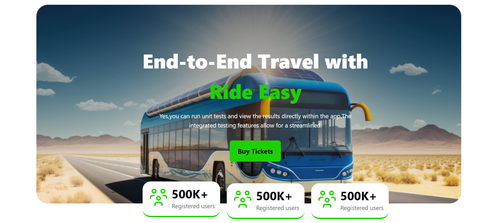
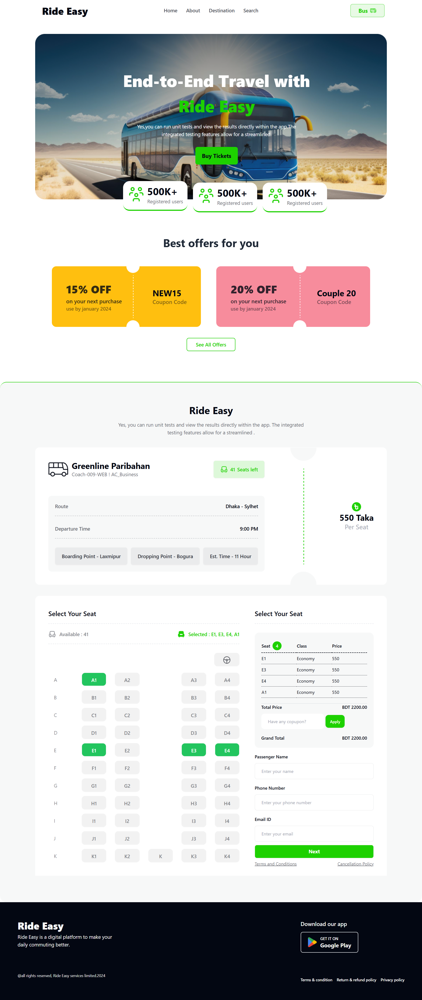

# 🚌 Ride Easy – Bus Ticket Booking Web Page

**Ride Easy** is a responsive single-page website where users can buy bus tickets with real-time seat selection, coupon-based discounts, and a checkout form validation system. it create with *HTML*, *CSS*, *TailwindCSS*, *DaisyUI*, *JavaScript*

[🔗 Live Demo](https://devo-ab.github.io/ride-easy)

---

## 🛠️ Tech Stack

- **HTML5**
- **CSS3**
- **Tailwind CSS**
- **DaisyUI**
- **JavaScript (DOM Manipulation)**
---

## 🌟 Features

- 🎫 Buy bus tickets online (up to 4 per user)
- ✅ Real-time seat availability updates
- 💸 Coupon system:
  - `NEW15` – 15% off
  - `Couple 20` – 20% off
- 📋 Checkout form validation (name, phone, and email required)
- 📊 Live price and seat count updates on the right panel
- 📱 Fully responsive for all screen sizes   

---

---

## 📁 Folder Structure

```
ride-easy/
├── assets/
│   ├── favicon/            # Favicon files
│   ├── icon/               # Icon files
│   ├── images/             # images files
│   ├── logo/               # logo files
├── preview/                # Screenshots for README
├── script/                 # JavaScript for area calculations
├── index.html              # Main landing page
└── README.md               # Project documentation
└── tailwind.config.js      # Tailwind config
```

---

## 🖼️ Screenshots

### 👣 Banner



### 👣 Seat Plan


### 👣 Full page preview



---

## 📲 How to Use Locally

1. **Clone the repo**
   ```bash
   git clone https://github.com/devo-ab/ride-easy.git
   cd ride-easy
   ```

# 👤 Author

# Avi Jit

## :mailbox: Reach me out

<p align="left">
<a href="https://linkedin.com/in/itsavijitb" target="blank"></a>
<a href="https://twitter.com/itsavijitb" target="blank"></a>
<a href="https://facebook.com/itsavijitb" target="blank"></a>
<a href="https://instagram.com/itsavijitb" target="blank"></a>
</p>
